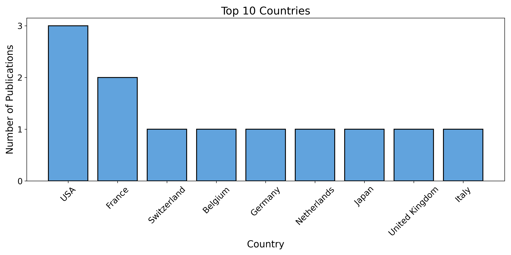
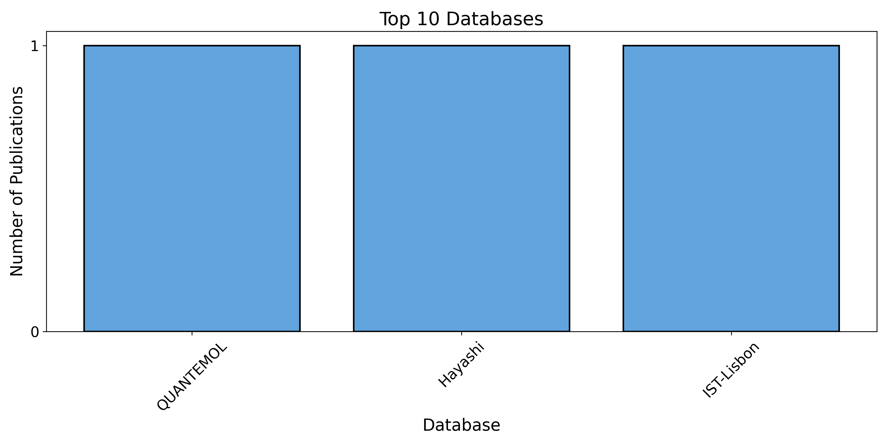
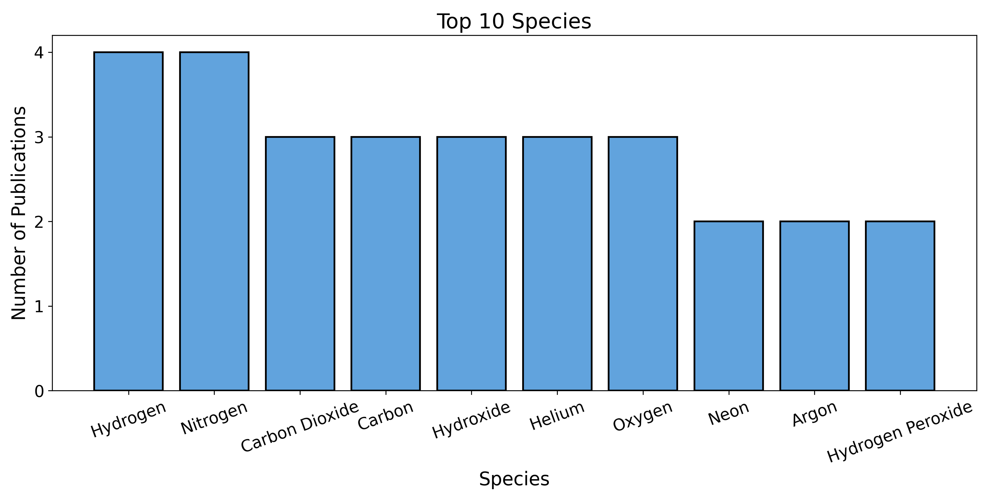

# Assessing the impact of Open Research Information Infrastructures using NLP driven full-text Scientometrics: A case study of the LXCat open-access platform

A robust, open-source Natural Language Processing (NLP) pipeline designed to extract real-world usage patterns of species, databases, and solvers from the full-text content of scientific literature citing the foundational LXCat papers. This project moves beyond traditional bibliometrics to provide deep, content-specific scientometric insights, quantifying the scientific impact of the Low-Temperature Plasma (LTP) community's data-sharing efforts. The pipeline automatically converts scientific PDFs to structured data, enabling researchers to analyze large document collections and generate actionable insights and trends.

## 🚀 Getting Started

These instructions will get you a copy of the project up and running on your local machine for development and testing purposes.

### Prerequisites

The pipeline requires two distinct environments due to dependencies (specifically chemdataextractor's requirement for older Python versions).

* Main Pipeline Environment (Python 3.11+)

* Chemical Entity Extraction Environment (Python 3.9)

### Setup and Installation

1. Create main pipeline environment

```bash
conda create -n lxcat_main python=3.11
conda activate lxcat_main

pip install -r requirements_main.txt
```

2. Create Gas TM environment

Install mamba

```bash
conda install -n base -c conda-forge mamba
```

```bash
mamba create -n lxcat_cde python=3.9
conda activate lxcat_cde

pip install -r requirements_cde.txt
cde data download
```

## 🔎 What This Pipeline Does

This fully automated pipeline processes raw scientific PDFs through multiple stages to generate structured output and visualizations.

1. **PDF to MD & JSON Conversion**

   * The pipeline begins by reading all input PDFs from `data/pdfs/` and convert each to a Markdown (`data/md/`) and a structured JSON (`data/jsons/`) representation. This dual-parsing approach ensures both clean text for NLP and structural metadata are preserved.

2. **Clean Markdown Files**

   * Once PDFs are converted to Markdown, the pipeline cleans the files by removing tables, math expressions, extra whitespace, blank lines and formatting artifacts. This step produces standardized, noise-free Markdown files in `data/cleaned_mds/` that are ready for reliable NLP processing.


3. **MD to TXT Conversion**

   * Cleaned Markdown files are converted to plain text (`data/txts/`) for core NLP processing.

3. **Information Extraction From Markdown**

* From the cleaned text files in `data/txts/`, the pipeline automatically extracts key scientific information:
  * **Chemical Species Extraction** using ChemDataExtractor
  * **LXCat Database Mention Extraction** through rule-based NLP
  * **BOLSIG+ Solver Usage Counting** at the sentence level
    
4. **JSONs → Country fetching**

   * The structural JSON outputs are parsed to reliably extract author affiliation and country information (using pycountry).

5. **Final aggregation and results**

   * All extracted information is aggregated into a single Excel workbook: `results/data/results.xlsx`.
   * A `results/plots/` folder contains several automatically generated plots (distribution of top chemical species, databases, countries etc.).

---

## 📊 Results

The pipeline generates content-specific scientometric insights from LXCat-cited full-text papers, including the most frequently mentioned chemical species, LXCat databases, and author-affiliation countries. All extracted entities are aggregated into `results/data/results.xlsx`, and summary visualizations are saved in `results/plots/`.

<p align="center">
  
  
  
</p>

## ⚙️ How to Run

1. Prepare input PDFs:

* Place all input PDFs into the `data/pdfs/` directory.

2. Run the Entire Pipeline:

```bash
# Ensure you are in the main environment for execution
conda activate lxcat_main
python main.py
```

If you prefer to run steps individually, open main.py and call the specific modularized functions in the `utils/` modules.

---

## 📂 Outputs

| **Directory / File**              | **Content Type**         | **Description** |
|----------------------------------|---------------------------|-----------------|
| `data/mds/`                        | *Raw Markdown*            | Markdown generated directly from PDFs. |
| `data/jsons/`                     | *Structured JSON*         | JSON files preserving structural metadata. |
| `data/txts/`                      | *Cleaned Plain Text*      | Final plain-text used for NLP extraction. |
| `results/data/results.xlsx`       | *Final Dataset*           | Consolidated spreadsheet containing all extracted entities (species, databases, BOLSIG+, countries). |
| `results/plots/`                  | *Visual Analytics*        | Automatically generated distribution plots. |

---

## 🛠️ Configuration & Customization

* Paths: You can change input/output paths by editing the path variables in `main.py`.

* Domain Adaptation: To adapt this pipeline for a different scientific domain (e.g., biology), you would primarily need to update the entity recognition and keyword lists used in the `utils/` modules (e.g., swapping ChemDataExtractor usage for a biology-specific entity recognizer).


---

## 📖 How to Cite

If you use this repository, methodology, extracted datasets, or results in your research, please cite the present GitHub project together with the abstract presented at the **APS Global Engineering Conference (GEC) 2025**.

This repository supports a research study on large-scale knowledge mining of LXCat-cited plasma literature and is intended to enable transparency, reproducibility, and extension of the presented analysis.

Once the full paper is officially published, this section will be updated with the final bibliographic reference.

---

### Temporary citation (GEC 2025 abstract – poster presentation)

**Conference abstract link:**  
https://schedule.aps.org/gec/2025/events/DT4/1

---

### BibTeX

```bibtex
@misc{LXCatImpactAnalysis2025,
  title        = {Uncovering and Analyzing the Scientific Impact of LXCat in Low-Temperature Plasma (LTP) Research: An NLP and Data-Driven Approach},
  author       = {Kalp Pandya, Khushi Shah, Nakshi Shah, Nirmal Shah, Bhaskar Chaudhury},
  howpublished = {\url{https://github.com/USERNAME/LXCat-impact-analysis}},
  note         = {Poster presented at the APS Global Engineering Conference (GEC) 2025},
  year         = {2025},
  url          = {https://schedule.aps.org/gec/2025/events/DT4/1}
}
