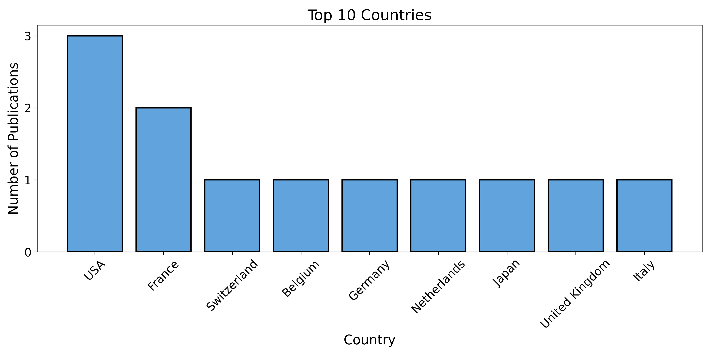
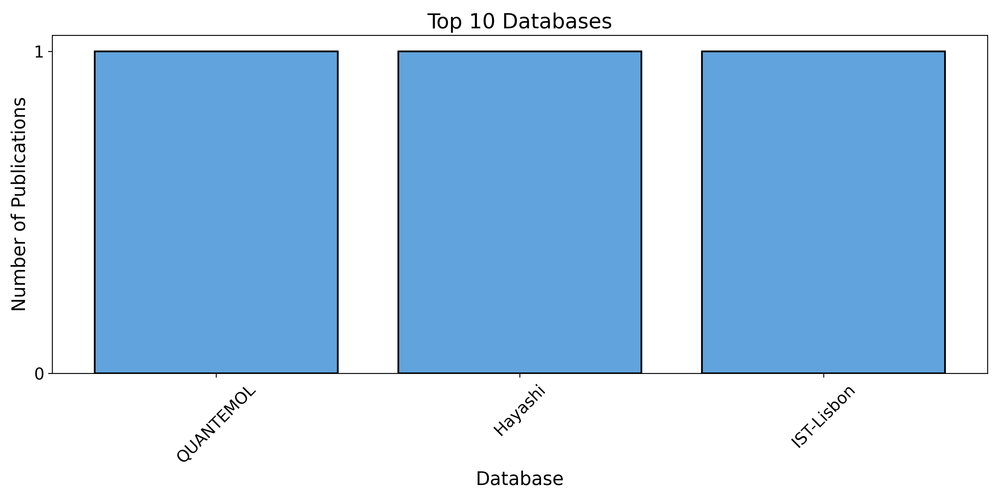
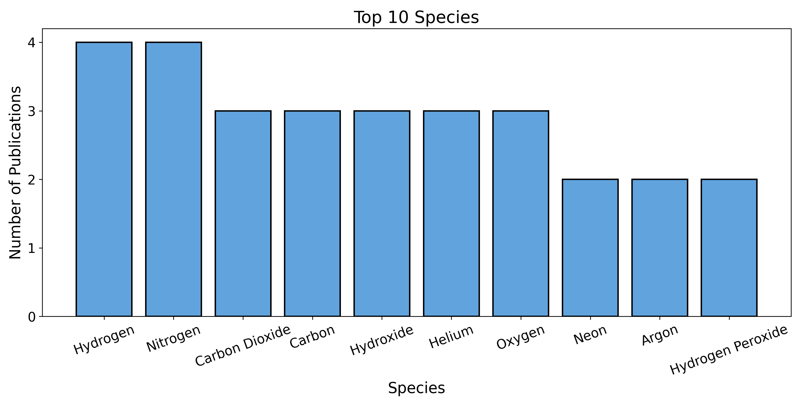

# Assessing the impact of Open Research Information Infrastructures using NLP driven full-text Scientometrics: A case study of the LXCat open-access platform

A robust, open-source Natural Language Processing (NLP) pipeline designed to extract domain-specific entities, databases, tools, and usage patterns from the full-text content of scientific literature. Originally developed to assess the impact of the LXCat open-access platform within the Low-Temperature Plasma (LTP) community, the pipeline has been generalized to support both chemical and non-chemical domains through configurable entity catalogs and extraction workflows. By moving beyond traditional citation-based bibliometrics, the framework enables content-driven scientometric analysis, allowing researchers to quantify the scientific impact, adoption, and evolution of research infrastructures, datasets, databases, and domain-specific concepts across large scientific corpora.

## 🚀 Getting Started

These instructions will get you a copy of the project up and running on your local machine for development and testing purposes.

### Prerequisites

The pipeline requires two distinct environments due to dependencies (specifically chemdataextractor's requirement for older Python versions).

* Main Pipeline Environment (Python 3.11+)

* Chemical Entity Extraction Environment (Python 3.9)

### Setup and Installation

1. Create main pipeline environment

```bash
conda create -n lxcat_main python=3.11
conda activate lxcat_main

cd LXCat-impact-analysis

pip install -r requirements_main.txt
```

2. Create Gas TM environment

Install mamba

```bash
conda install -n base -c conda-forge mamba
```

```bash
mamba create -n lxcat_cde python=3.9
conda activate lxcat_cde

pip install chemdataextractor
pip install -r requirements_cde.txt  
cde data download
```

## 🔎 What This Pipeline Does

This fully automated pipeline processes raw scientific PDFs through multiple stages to generate structured output and visualizations.

1. **PDF to MD & JSON Conversion**

   * The pipeline begins by reading all input PDFs from `documents/pdfs/` and convert each to a Markdown (`documents/mds/`) and a structured JSON (`documents/jsons/`) representation. This dual-parsing approach ensures both clean text for NLP and structural metadata are preserved.

2. **Clean Markdown Files**

   * Once PDFs are converted to Markdown, the pipeline cleans the files by removing tables, math expressions, extra whitespace, blank lines and formatting artifacts. This step produces standardized, noise-free Markdown files in `documents/cleaned_mds/` that are ready for reliable NLP processing.


3. **MD to TXT Conversion**

   * Cleaned Markdown files are converted to plain text (`documents/txts/`) for core NLP processing.

4. **Information Extraction From Text**

* From the cleaned text files, the pipeline automatically extracts key scientific information:
  * **Domain-Specific Entity Extraction**
    * **Chemical Domains:** ChemDataExtractor-based entity recognition with synonym and abbreviation resolution.
    * **Non-Chemical Domains:** Catalog-driven entity extraction using configurable root-name and synonym mappings.
  * **LXCat Database Mention Extraction** through rule-based NLP.
  * **BOLSIG+ Solver Usage Counting** at the sentence level.
  * **Country Fetching** from  structural JSON outputs.

5. **Final aggregation and results**

   * All extracted information is aggregated into a single Excel workbook: `results/data/results.xlsx`.
   * A `results/plots/` folder contains several automatically generated plots (distribution of top chemical species, databases, countries etc.).

---

## Domain Generalization

* The species extraction framework supports two operating modes:

  * **Chemical Domain Mode**

    * Uses ChemDataExtractor (CDE) for context-aware chemical entity recognition.
    * Resolves extracted entities using a configurable species catalog.
    * Supports synonym and abbreviation mapping (e.g., CO₂ → carbon dioxide, N₂ → nitrogen).
    * LXCat gas filtering for Low-Temperature Plasma studies.

  * **Non-Chemical Domain Mode**

    * Does not require ChemDataExtractor.
    * Uses catalog-driven whole-word matching and synonym resolution.
    * Supports extraction of domain-specific concepts, species, tools, technologies, or entities from any scientific discipline.
    * Enables reuse of the pipeline across diverse scientometric studies with minimal configuration changes.

* **Custom Domain Catalog Support**

  * Users may provide their own domain catalog containing canonical entity names and associated synonyms/abbreviations.
  * During execution, the pipeline can prompt the user to either use the default catalog or supply a custom catalog path.
  * This allows the same framework to be applied to different research domains without modifying the extraction logic.


## ⚙️ How to Run

1. Prepare input PDFs:

* Place all input PDFs into the `documents/pdfs/` directory.

2. Run the Entire Pipeline:

```bash
# Ensure you are in the main environment for execution
conda activate lxcat_main
python main.py
```

If you prefer to run steps individually, open main.py and call the specific modularized functions in the `utils/` modules.

---

## 📂 Outputs

| **Directory / File**              | **Content Type**         | **Description** |
|----------------------------------|---------------------------|-----------------|
| `documents/mds/`                        | *Raw Markdown*            | Markdown generated directly from PDFs. |
| `documents/jsons/`                     | *Structured JSON*         | JSON files preserving structural metadata. |
| `documents/txts/`                      | *Cleaned Plain Text*      | Final plain-text used for NLP extraction. |
| `results/data/results.xlsx`       | *Final Dataset*           | Consolidated spreadsheet containing all extracted entities (species, databases, BOLSIG+, countries). |
| `results/plots/`                  | *Visual Analytics*        | Automatically generated distribution plots. |

---

## 🛠️ Configuration & Customization

* **Paths:** Input and output directories can be customized by modifying the path variables in `main.py`.

* **Domain Adaptation:** The pipeline supports both chemical and non-chemical domains.

  * For **chemical domains**, ChemDataExtractor (CDE) is used for context-aware entity recognition and synonym resolution.
  * For **non-chemical domains**, users can provide their own domain catalog containing canonical entity names and associated synonyms/abbreviations.

* **Custom Domain Catalogs:** During execution, the species extraction stage can prompt the user to either:

  * Use the default species catalog generated from the dataset, or
  * Provide a custom domain catalog CSV.

* **Entity Catalog Format:** Custom catalogs should contain canonical entity names (`root_name`) along with their associated synonyms, abbreviations, or alternate forms. This enables the same extraction and counting workflow to be reused across different scientific disciplines without modifying the core pipeline logic.

---

## 📊 Results

The pipeline generates content-specific scientometric insights from LXCat-cited full-text papers, including the most frequently mentioned chemical species, LXCat databases, and author-affiliation countries. All extracted entities are aggregated into `results/data/results.xlsx`, and summary visualizations are saved in `results/plots/`.

<p align="center">
  
  
  
</p>

---

## 📖 How to Cite

If you use this repository, methodology, extracted datasets, or results in your research, please cite the present GitHub project together with the **Arxiv paper**.

This repository supports a research study on large-scale knowledge mining of LXCat-cited plasma literature and is intended to enable transparency, reproducibility, and extension of the presented analysis.

Once the full paper is officially published, this section will be updated with the final bibliographic reference.

---

### Temporary citation (Arxiv paper)
https://arxiv.org/abs/2602.07664

---

### BibTeX

```bibtex
@article{pandya2026assessing,
  title={Assessing the impact of Open Research Information Infrastructures using NLP driven full-text Scientometrics: A case study of the LXCat open-access platform},
  author={Pandya, Kalp and Shah, Khushi and Shah, Nirmal and Shah, Nakshi and Chaudhury, Bhaskar},
  journal={arXiv preprint arXiv:2602.07664},
  year={2026}
}